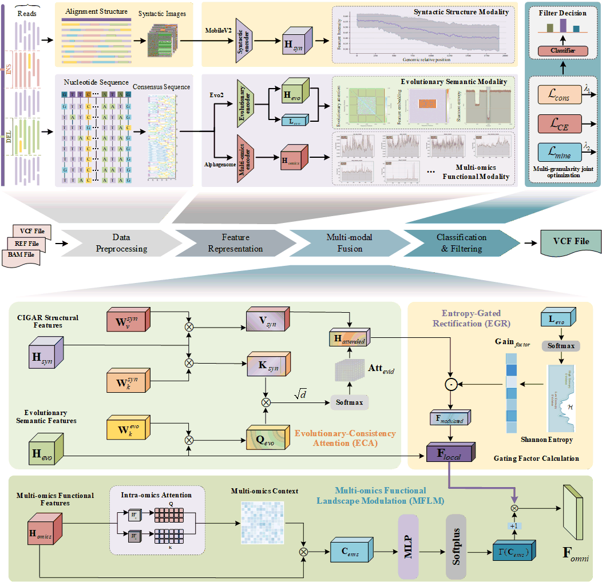

# Omni-SVF: knowledge-guided multi-modal fusion across alignment, evolutionary, and multi-omics for long-read structural variant filtering

**Omni-SVF** is a pioneering knowledge-guided multi-modal framework that integrates **Genomic Foundation Models (GFMs)** into high-fidelity Structural Variant (SV) filtering. By synergizing syntactic structure features, deep evolutionary semantics, and functional genomic landscapes, Omni-SV transforms SV analysis from error-prone pattern matching to deep biological semantic understanding.

<!-- **Status:** Research Prototype (Based on ACMMM 2026 Conference Anonymous Submission Id: 9174) -->
---

## 📖 Introduction

Detecting structural variations (SVs) from long-read sequencing data remains a critical challenge due to high stochastic noise and complex genomic contexts. Traditional methods often fail to capture deep biological semantics, relying primarily on raw alignment signals.

Omni-SV addresses this by introducing a **trinitarian synergistic perception framework**:
1.  **Syntactic Structure Modality:** Extracts alignment trajectories (CIGAR strings).
2.  **Evolutionary Semantic Modality:** Leverages **Evo2** to generate Shannon entropy landscapes and spatiotemporal attention maps.
3.  **Functional Genomic Modality:** Utilizes **AlphaGenome** to project candidates onto high-resolution epigenetic landscapes.

We introduce the **Evolutionary-Anchored Asymmetric Neural Rectification (EAANR)** mechanism, which uses evolutionary priors to dynamically audit and rectify noisy syntactic signals. This ensures robust decision-making even when physical signals are ambiguous.
---

## 🏗️ Model Architecture

The Omni-SVF architecture employs a hierarchical multi-modal fusion paradigm to reconcile noisy genomic alignment signals with high-order biological priors. The framework processes SV candidates through three distinct functional stages:

<!-- Insert Figure 2 from Paper Here -->
<p align="center">
  
  <br>
  <em>Figure 1: The overall architecture of Omni-SV. (1) Heterogeneous Modality Representation; (2) Knowledge-Guided Multi-modal Fusion; (3) Optimization Strategy; (d) Functional Landscape Modulation; (e) Optimization.</em>
</p>

### 1. Heterogeneous Modality Representation

The input data are projected into a unified latent space using three specialized encoders:

* **Syntactic Encoder (MobileV2):** Extracts topological features from CIGAR-based syntactic images, capturing the physical alignment structure of SV candidates.
* **Evolutionary Encoder (Evo2):** Encodes sequence-level semantics to identify evolutionary conservation patterns that distinguish genuine variants from stochastic noise.
* **Multi-omics Encoder (AlphaGenome):** Maps consensus sequences into functional tracks, providing *in vivo* regulatory contexts such as chromatin accessibility and histone modification profiles.

### 2. Knowledge-Guided Multi-modal Fusion

To address the limitations of single-modality filtering, we introduce two core modules that enforce biological consistency:

* **Evolutionary-Anchored Asymmetric Neural Rectification (EAANR):** This module incorporates an **Evolutionary-Consistency Attention (ECA)** mechanism and an **Entropy-Gated Rectification (EGR)** unit. By computing site-specific Shannon entropy from Evo2 logits, the EGR adaptively gates and rectifies local alignment features, effectively suppressing false positives in unstable, repetitive regions.
* **Multi-omics Functional Landscape Modulation (MFLM):** This module grounds physical alignment trajectories within real-time biochemical context vectors. By non-linearly scaling local features ($F_{local}$) through a Softplus-activated MLP, the MFLM calibrates the final Omni-feature representation ($F_{omni}$) against the genome's regulatory logic, ensuring that high-confidence variants are substantiated by cross-disciplinary biological evidence.

### 3. Optimization Strategy

Omni-SVF is optimized through a multi-granularity joint loss function:


$$\mathcal{L}_{total} = \mathcal{L}_{CE} + \lambda_1 \mathcal{L}_{cons} + \lambda_2 \mathcal{L}_{mine}$$


This objective function balances classification accuracy ($\mathcal{L}_{CE}$) with representation consistency ($\mathcal{L}_{cons}$) and mutual information maximization ($\mathcal{L}_{mine}$), ensuring that the model learns discriminative features that are robust to sequencing artifacts.

---

## 📊 Key Features

* **🧬 Knowledge-Guided Fusion:** Unlike traditional methods, we use pre-trained Genomic Foundation Models (Evo2 and AlphaGenome) as prior knowledge to guide the filtering process.
* **🛡️ EAANR Mechanism:** Our proprietary Evolutionary-Anchored Asymmetric Neural Rectification module uses entropy-gating to suppress false positives in unstable genomic regions.
* **🌍 Cross-Species Generalization:** Validated on both *Homo sapiens* (Human) and *Arabidopsis thaliana* genomes.
* **⚡ Multi-Granularity Optimization:** A joint loss function that ensures representation consistency and mutual information maximization.

## 🚀 Getting Started

This section outlines the basic setup required to run Omni-SV based on the reference implementation.

### Prerequisites

*   **Python:** >= 3.11
*   **PyTorch:** 2.1
*   **Hardware:** NVIDIA GPU (Recommended: 24GB显存 RTX 4090 6152)
*   **Dependencies:** pandas, numpy, biopython, pysam

### Installation

```bash
# 1. Clone the repository
git clone https://github.com/sokolo05/Omni-SV.git
cd Omni-SV

# 2. Create a virtual environment (recommended)
python -m venv omni-sv-env
source omni-sv-env/bin/activate # On Windows: omni-sv-env\Scripts\activate

# 3. Install PyTorch (Select the appropriate command for your CUDA version)
# Example for CUDA 12.4:
pip install torch==2.1.0 torchvision==0.16.0 torchaudio==2.1.0 --index-url https://download.pytorch.org/whl/cu124

# 4. Install other requirements
pip install -r requirements.txt
```

## 📚 Essential Bioinformatics Dependencies

| Dependency & Logo | Description |
| :--- | :--- |
| [](https://github.com/rvaser/spoa) | SIMD partial order alignment for noise reduction |
| [](https://github.com/ArcInstitute/evo2) | GFM for evolutionary sequence embeddings |
| [](https://github.com/google-deepmind/alphagenome) | Genomic foundation model for functional semantics |
| [](https://github.com/pysam-developers/pysam) | BAM/CRAM file processing |
| [](https://github.com/biopython/biopython) | Sequence analysis and manipulation |
| [](https://github.com/tjiangHIT/cuteSV) | Signature-based long-read SV caller |
| [](https://github.com/fritzsedlazeck/Sniffles) | High-throughput long-read SV caller |
| [](https://github.com/eldariont/svim) | SV identification using long-read mappings |
| [](https://github.com/xcxw127/CSV-Filter) | Collaborative SV filtering baseline |
| [](https://github.com/xcxw127/MMF-SV) | Multi-modal fusion for structural variation |
| [](https://github.com/jdoughertyii/PyVCF) | VCF file parsing and writing |
| [](https://github.com/ACEnglish/truvari) | SV benchmarking and comparison |
| [](https://github.com/fritzsedlazeck/SURVIVOR) | Tool for merging and comparing SV calls |

## 🛠️ Data Preparation (Preprocessing)

The Omni-SV pipeline requires a specific preprocessing stage to generate the necessary triplet features (Syntactic, Evolutionary, Functional) from raw sequencing data. This is handled by the `preprocess` mode in `OmniSV.py`.

### Preprocessing Command

You must run this step first to prepare the data before training or refinement.

```
python OmniSV.py preprocess \
    <vcf_path> \
    <bam_path> \
    <output_dir> \
    <reference_fasta>
```

### Arguments

- `vcf_path`: Path to the input VCF file containing candidate SVs.
- `bam_path`: Path to the input BAM alignment file.
- `output_dir`: Directory where processed data and features will be saved.
- `reference_fasta`: Path to the reference genome (`.fa`).

### Pipeline Steps

The `preprocess` mode executes the following sub-tasks sequentially:

1. **Parse VCF:** Runs `parse_vcf.sh` to standardize the VCF input.
2. **Data Preparation:** Executes `data_main.py` to generate images and initial sequence reconstructions.
3. **Feature Extraction:**
    - **Evo2:** Runs `evo2_encoder.py` to extract evolutionary features.
    - **AlphaGenome:** Runs `alphagenome_encoder.py` to extract functional genomic features.
    - **Image:** Runs `image_encoder.py` to process syntactic images.

## 🚀 Model Training

Once the data is preprocessed, you can train the Omni-SV model using the `train` mode. This stage utilizes the extracted features to perform 5-Fold Cross-Validation with F1-score optimization.

### Training Command

```
python OmniSV.py train \
    <label_json> \
    <feat_dir> \
    <save_dir> \
    <model_name> \
    <gpu_id>
```

### Arguments

- `label_json`: Path to the JSON file containing ground truth labels (generated during preprocessing).
- `feat_dir`: The same `<output_dir>` used in the preprocessing step. The script automatically looks for `syn_feats`, `evo_feats`, and `functional_feats` subfolders inside it.
- `save_dir`: Directory where the trained model checkpoints will be saved.
- `model_name`: Name of the model to be saved.
- `gpu_id`: GPU device ID to use (e.g., `0`).

### Training Details

- **Optimizer:** AdamW with F1-score based checkpointing.
- **Loss Function:** Multi-Granularity Optimization (MGO) loss.
- **Hyperparameters:** Default epochs set to 50, batch size 64 (defined in `model_trainer.py`).

## 🧪 Result Refinement

The `refine` mode performs inference on new data and revises the original VCF file. It filters out false positives (MATCH) and corrects SV types (DEL/INS) based on model predictions.

### Refinement Command

```
python OmniSV.py refine \
    <feat_dir> \
    <model_path> \
    <vcf_to_revise> \
    <output_vcf> \
    <gpu_id>
```

### Arguments

- `feat_dir`: Directory containing the extracted features for inference.
- `model_path`: Path to the trained model checkpoint (`.pth`).
- `vcf_to_revise`: Path to the original VCF file you wish to improve.
- `output_vcf`: Path where the refined, high-fidelity VCF file will be saved.
- `gpu_id`: GPU device ID to use.

### Workflow

1. **Prediction:** Runs `model_predictor.py` to generate predictions (saved as `predictions.csv`).
2. **Revision:** Runs `revise_vcf.py` to update the VCF file based on the predictions, filtering false positives and correcting variant types.

## 📦 Full Pipeline Example

### Complete End-to-End Workflow

```
# Step 1: Preprocessing
python OmniSV.py preprocess \
    ./data/raw_calls.vcf \
    ./data/alignments.bam \
    ./processed_data/ \
    ./reference/hg38.fa

# Step 2: Training (optional if using pre-trained model)
python OmniSV.py train \
    ./processed_data/labels.json \
    ./processed_data/ \
    ./models/ \
    omni_sv_model \
    0

# Step 3: Refinement
python OmniSV.py refine \
    ./processed_data/ \
    ./models/omni_sv_model.pth \
    ./data/raw_calls.vcf \
    ./results/refined_calls.vcf \
    0
```

## 📚 Documentation

For detailed documentation on each component, please refer to the individual module documentation:

- `parse_vcf.sh`: VCF parsing utility
- `data_prepare/`: Data preprocessing modules
- `feature_extract/`: Feature extraction pipelines
- `model_trainer.py`: Training implementation
- `model_predictor.py`: Inference implementation
- `revise_vcf.py`: VCF refinement utility

## 🙏 Acknowledgments

- The developers of Evo2 and AlphaGenome models
- The open-source bioinformatics community
- The PyTorch development team
