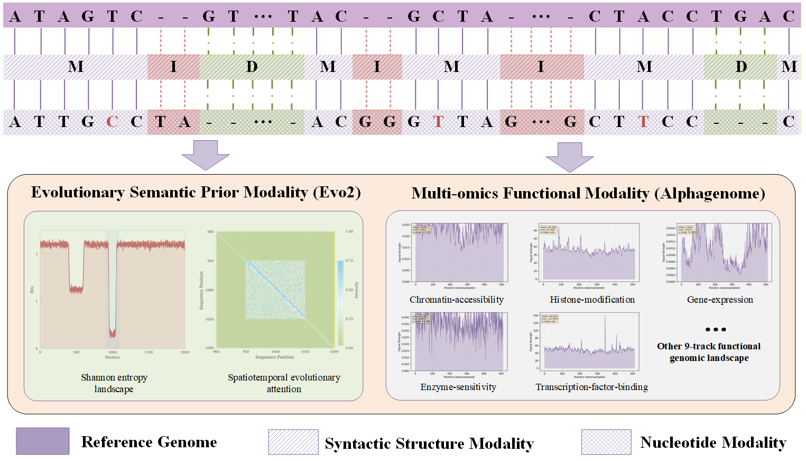
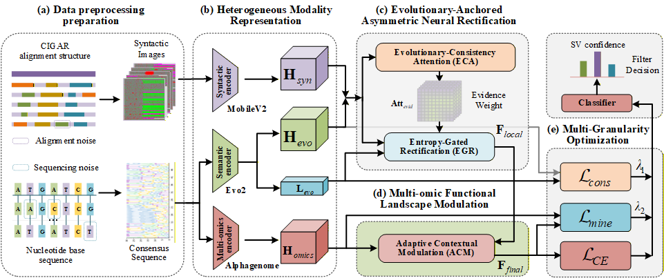

# Omni-SV: A Knowledge-Guided Multi-Modal Genomic Foundation Model Framework for Structural Variant Filtering

**Omni-SV** is a pioneering knowledge-guided multi-modal framework that integrates **Genomic Foundation Models (GFMs)** into high-fidelity Structural Variant (SV) filtering. By synergizing syntactic structure features, deep evolutionary semantics, and functional genomic landscapes, Omni-SV transforms SV analysis from error-prone pattern matching to deep biological semantic understanding.

**Status:** Research Prototype (Based on ACMMM 2026 Conference Submission)

---

## 📖 Introduction

Detecting structural variations (SVs) from long-read sequencing data remains a critical challenge due to high stochastic noise and complex genomic contexts. Traditional methods often fail to capture deep biological semantics, relying primarily on raw alignment signals.

Omni-SV addresses this by introducing a **trinitarian synergistic perception framework**:
1.  **Syntactic Structure Modality:** Extracts alignment trajectories (CIGAR strings).
2.  **Evolutionary Semantic Modality:** Leverages **Evo2** to generate Shannon entropy landscapes and spatiotemporal attention maps.
3.  **Functional Genomic Modality:** Utilizes **AlphaGenome** to project candidates onto high-resolution epigenetic landscapes.

We introduce the **Evolutionary-Anchored Asymmetric Neural Rectification (EAANR)** mechanism, which uses evolutionary priors to dynamically audit and rectify noisy syntactic signals. This ensures robust decision-making even when physical signals are ambiguous.

### Visual Representation of Modalities
Below is the overview of the Multi-modal Co-perception Framework as described in our research:

<!-- Insert Figure 1 from Paper Here -->
<p align="center">
  
  <br>
  <em>Figure 1: The Multi-modal Co-perception Framework. Omni-SV synergizes syntactic structures, evolutionary semantics (Evo2), and functional genomics (AlphaGenome) for SV representation.</em>
</p>

---

## 🏗️ Model Architecture

The Omni-SV architecture is designed to bridge the gap between noisy genomic signals and high-level biological priors through a hierarchical integration paradigm.

The pipeline consists of three stages:
1.  **Heterogeneous Modality Representation:** Projects inputs into a unified latent space.
2.  **EAANR Module:** Performs asymmetric rectification using evolutionary constraints.
3.  **Multi-omics Functional Landscape Modulation:** Calibrates features against the biochemical background.

### Architecture Diagram
The figure below illustrates the detailed workflow of data preprocessing, feature representation, and optimization:

<!-- Insert Figure 2 from Paper Here -->
<p align="center">
  
  <br>
  <em>Figure 2: The overall architecture of Omni-SV. (a) Data preprocessing; (b) Heterogeneous modality representation; (c) EAANR; (d) Functional Landscape Modulation; (e) Optimization.</em>
</p>

---

## 📊 Key Features

*   **🧬 Knowledge-Guided Fusion:** Unlike traditional methods, we use pre-trained Genomic Foundation Models (Evo2 and AlphaGenome) as prior knowledge to guide the filtering process.
*   **🛡️ EAANR Mechanism:** Our proprietary Evolutionary-Anchored Asymmetric Neural Rectification module uses entropy-gating to suppress false positives in unstable genomic regions.
*   **🌍 Cross-Species Generalization:** Validated on both *Homo sapiens* (Human) and *Arabidopsis thaliana* genomes.
*   **⚡ Multi-Granularity Optimization:** A joint loss function that ensures representation consistency and mutual information maximization.

---

## 🚀 Getting Started

This section outlines the basic setup required to run Omni-SV based on the reference implementation.

### Prerequisites

*   **Python:** >= 3.11
*   **PyTorch:** 2.1
*   **Hardware:** NVIDIA GPU (Recommended: 24GB显存 RTX 4090 6152)
*   **Dependencies:** pandas, numpy, biopython, pysam

### Installation

```bash
# 1. Clone the repository
git clone https://github.com/sokolo05/Omni-SV.git
cd Omni-SV

# 2. Create a virtual environment (recommended)
python -m venv omni-sv-env
source omni-sv-env/bin/activate # On Windows: omni-sv-env\Scripts\activate

# 3. Install PyTorch (Select the appropriate command for your CUDA version)
# Example for CUDA 12.4:
pip install torch==2.1.0 torchvision==0.16.0 torchaudio==2.1.0 --index-url https://download.pytorch.org/whl/cu124

# 4. Install other requirements
pip install -r requirements.txt
```

## Essential Bioinformatics Dependencies

| Package                                                      | Purpose                             |
| ------------------------------------------------------------ | ----------------------------------- |
|  | BAM/CRAM file processing            |
|  | Sequence analysis and manipulation  |
|  | Sequence alignment and mapping      |
|  | SV detection and calling            |
|  | Long-read SV caller                 |
|  | Genomic interval handling           |
|  | FASTA file indexing and access      |
|  | VCF file parsing and writing        |
|  | SV benchmarking and comparison      |
|  | Read simulation and quality control |
|  | SIMD partial order alignment tool |
